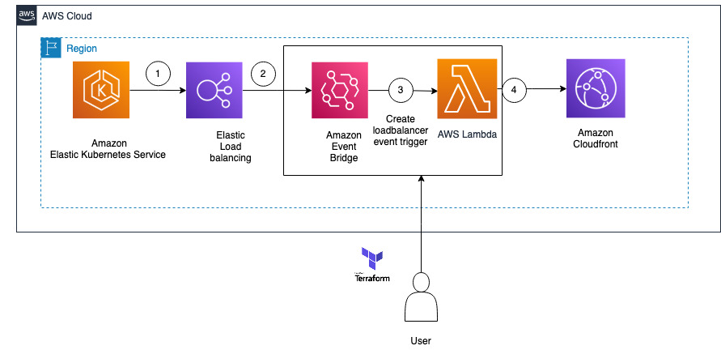

# CloudFront update Terraform sample


## Introduction

This AWS sample code helps to resolve one of the customer real time issues which is explained further. When customer deletes and reinstall the helm chart which is containing ingress, It recreates the Application Loadbalancer. Due to this its mapping in Amazon CloudFront will have stale record and services/application becomes unreachable. 

With the help of terraform templates , Lambda function will be deployed on this specific account . Based on the loadbalancer creation event, AWS Lambda will get triggered. AWS Lambda function[ python and boto3 api ] will update the Amazon CloudFront entry with latest loadbalancer DNS name.

This solution helps the customers to avoid stale entry in cloudfront and reduce the manual work to update the entries after helm deployment or restart. Also this solution ensures customer will not face any latency/impact with their business process because of this implementation.

## Target Architecture



## Deployment steps
```
export AWS_REGION={{ REGION }}
terraform init
terraform plan
terraform apply
```

<!-- BEGIN_TF_DOCS -->
## Requirements

| Name | Version |
|------|---------|
| <a name="requirement_terraform"></a> [terraform](#requirement\_terraform) | >= 1.0.0 |
| <a name="requirement_aws"></a> [aws](#requirement\_aws) | >= 4.20.1 |

## Providers

| Name | Version |
|------|---------|
| <a name="provider_archive"></a> [archive](#provider\_archive) | n/a |
| <a name="provider_aws"></a> [aws](#provider\_aws) | >= 4.20.1 |

## Modules

No modules.

## Resources

| Name | Type |
|------|------|
| [aws_cloudwatch_event_rule.create_loadbalancer_event](https://registry.terraform.io/providers/hashicorp/aws/latest/docs/resources/cloudwatch_event_rule) | resource |
| [aws_cloudwatch_event_target.create_loadbalancer_event_target](https://registry.terraform.io/providers/hashicorp/aws/latest/docs/resources/cloudwatch_event_target) | resource |
| [aws_iam_role.cloudfront-role](https://registry.terraform.io/providers/hashicorp/aws/latest/docs/resources/iam_role) | resource |
| [aws_iam_role_policy.S3Accesshelper](https://registry.terraform.io/providers/hashicorp/aws/latest/docs/resources/iam_role_policy) | resource |
| [aws_iam_role_policy_attachment.role-policy-attachment](https://registry.terraform.io/providers/hashicorp/aws/latest/docs/resources/iam_role_policy_attachment) | resource |
| [aws_lambda_function.cloudfrontfunction](https://registry.terraform.io/providers/hashicorp/aws/latest/docs/resources/lambda_function) | resource |
| [aws_lambda_permission.allow_cloudwatch_to_call_lambda](https://registry.terraform.io/providers/hashicorp/aws/latest/docs/resources/lambda_permission) | resource |
| [archive_file.lambda_my_function](https://registry.terraform.io/providers/hashicorp/archive/latest/docs/data-sources/file) | data source |
| [aws_caller_identity.current](https://registry.terraform.io/providers/hashicorp/aws/latest/docs/data-sources/caller_identity) | data source |
| [aws_partition.current](https://registry.terraform.io/providers/hashicorp/aws/latest/docs/data-sources/partition) | data source |
| [aws_region.current](https://registry.terraform.io/providers/hashicorp/aws/latest/docs/data-sources/region) | data source |

## Inputs

| Name | Description | Type | Default | Required |
|------|-------------|------|---------|:--------:|
| <a name="input_cloudfront_distribution_id"></a> [cloudfront\_distribution\_id](#input\_cloudfront\_distribution\_id) | cloudfront\_distribution\_id | `string` | n/a | yes |
| <a name="input_iam_policy_arn"></a> [iam\_policy\_arn](#input\_iam\_policy\_arn) | IAM Policy to be attached to role | `list(string)` | <pre>[<br>  "arn:aws:iam::aws:policy/AmazonEventBridgeReadOnlyAccess",<br>  "arn:aws:iam::aws:policy/service-role/AWSLambdaBasicExecutionRole"<br>]</pre> | no |

## Outputs

No outputs.
<!-- END_TF_DOCS -->

## Verify Solution Deployment
1.	Validate the loadbalancer DNS name in cloudfront configuration and event logs.

## Cleanup

When finished, you can delete the resources as follows:

```
cd ./terraform
terraform destroy
```

When prompted enter `yes` to allow the stack termination to proceed.
## Security

See [CONTRIBUTING](CONTRIBUTING.md#security-issue-notifications) for more information.

## License

This library is licensed under the MIT-0 License. See the LICENSE file.
